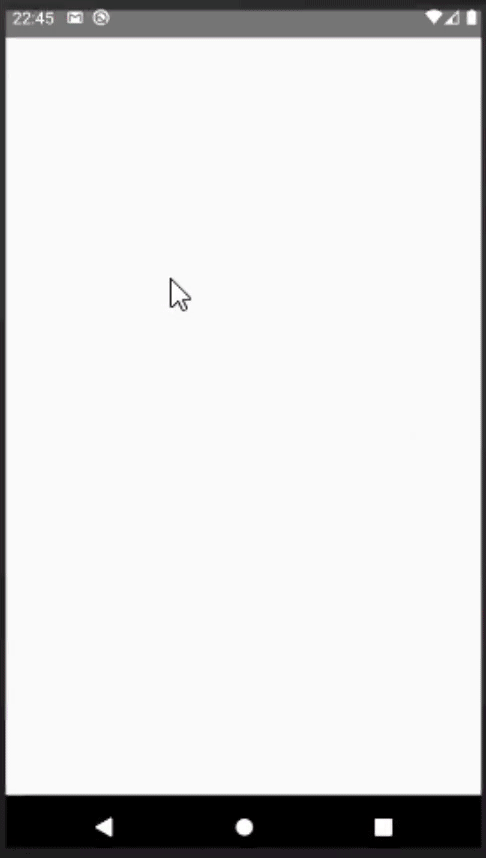

### Lista de todos os projetos desenvolvidos em Hackathons, eventos de tecnologia e similares.

 

## 2 - Woshi
Projeto desenvolvido no Hackathon da XXV Semana de Informática da Faculdade Federal de Viçosa. 
O tema foi: MELHORAR A INTERAÇÃO ENTRE OS COLEGAS DE TRABALHO EM TEMPOS DE PANDEMIA.

#### Proposta do app: 
App multiplataforma com foco totalmente na imersão de comunicação em grupos, modelo inspirado na comunicação que ocorre em "coworkings", com chats específicos para cada time e chats entre empresas e colaboradores de vários setores diferentes. Além de garantir rodadas de conversas randômicas (FunChat), inspiradas nas conversas tradicionais que ocorrem no ambiente presencial.

#### Data de realização: 28 de novembro de 2020

  
Tecnologias/Libs usadas

  
 - React-Native
 - JavaScript
 - Expo
 - react-navigation drawer
 - react-navigation stack
 - react-native-calendars

#### Fotos do app:
  |   |    | 
:---------------:|:----------------:|:-----------------:|

  |   |    | 
:---------------:|:----------------:|:-----------------:|

 

## 1 - Ciclo Contínuo
Projeto desenvolvido no hackasustentavel do Congonhas Inova.

#### Data de realização: 19 de julho de 2020

  
Tecnologias/Libs usadas

  
 - React-Native
 - JavaScript
 - lottie-react-native
 - async-storage
 - react-native-svg
 - redux
 - redux-persist
 - redux-thunk
 - react-native-linear-gradient
 - react-navigation stack

#### Fotos do app:
  |   |    |    |
:---------------:|:----------------:|:-----------------:|:-----------------:|

 
 
