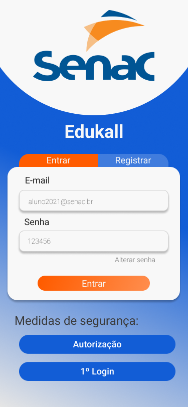
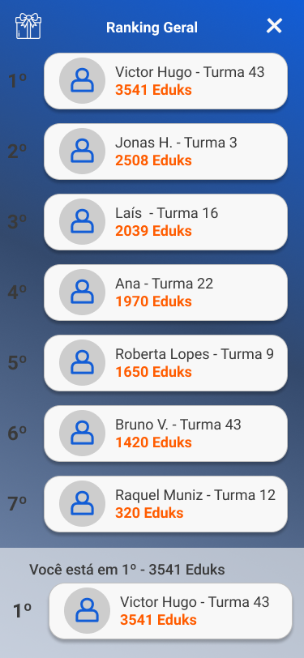

### Lista de todos os projetos desenvolvidos em Hackathons, eventos de tecnologia e similares.

 

## 3 - EdukAll
EdukAll é uma plataforma digital que promove interação entre alunos presenciais e online para ser criado uma maior união entre as turmas através de gamificação, além de promover competições focadas em trabalho em equipe através de minigames com rankeamento de pontos. O fluxo simplificado e completo pode ser visto logo abaixo:

  
Tecnologias/Libs usadas

 - Javascript
 - React-Native
 - Expo
 - Firebase
 - Lottie animations
 - React Navigation
 - react native dotenv
 - expo linear gradient
 - expo font
 - Firestore database

#### Fluxo simplificado:

#### Tela de Login - Minigame em dupla - Tela com ranking

  |   |    |  
:---------------:|:----------------:|:-----------------:|

 

#### Fluxo completo de um usuário no app:

 

 

## 2 - Woshi
Projeto desenvolvido no Hackathon da XXV Semana de Informática da Faculdade Federal de Viçosa. 
O tema foi: MELHORAR A INTERAÇÃO ENTRE OS COLEGAS DE TRABALHO EM TEMPOS DE PANDEMIA.

#### Proposta do app: 
App multiplataforma com foco totalmente na imersão de comunicação em grupos, modelo inspirado na comunicação que ocorre em "coworkings", com chats específicos para cada time e chats entre empresas e colaboradores de vários setores diferentes. Além de garantir rodadas de conversas randômicas (FunChat), inspiradas nas conversas tradicionais que ocorrem no ambiente presencial.

#### Data de realização: 28 de novembro de 2020

  
Tecnologias/Libs usadas

  
 - React-Native
 - JavaScript
 - Expo
 - react-navigation drawer
 - react-navigation stack
 - react-native-calendars

#### Fotos do app:
  |   |    | 
:---------------:|:----------------:|:-----------------:|

  |   |    | 
:---------------:|:----------------:|:-----------------:|

 

 

## 1 - Ciclo Contínuo
Projeto desenvolvido no hackasustentavel do Congonhas Inova.

#### Data de realização: 19 de julho de 2020

  
Tecnologias/Libs usadas

  
 - React-Native
 - JavaScript
 - lottie-react-native
 - async-storage
 - react-native-svg
 - redux
 - redux-persist
 - redux-thunk
 - react-native-linear-gradient
 - react-navigation stack

#### Fotos do app:
  |   |    |    |
:---------------:|:----------------:|:-----------------:|:-----------------:|

 
 
