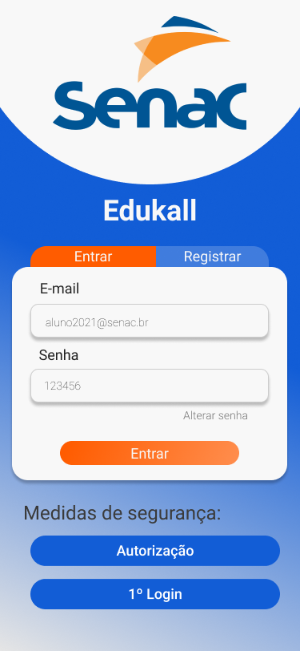
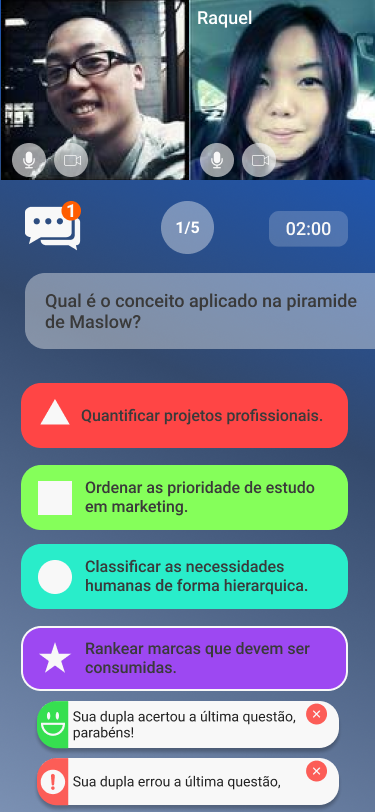
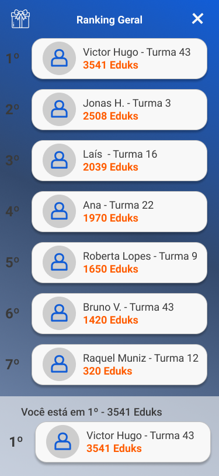
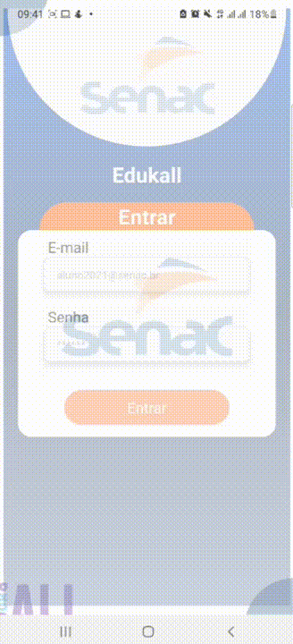

<h1 align="center">
    
     
    📚 EdukaAll 📚
</h1>

<h4 align="right">
        Baixe o App agora para Android!
    

        
    

</h4>

<h3 align="center">
    Interação é mais aprendizado
</h3>

  <a href="#edukaall--ods4">EdukaALL</a>&nbsp;&nbsp;&nbsp;|&nbsp;&nbsp;&nbsp;
  <a href="#nosso-produto-resumo">Nosso Produto</a>&nbsp;&nbsp;&nbsp;|&nbsp;&nbsp;&nbsp;
  <a href="#tecnologias">Tecnologias</a>&nbsp;&nbsp;&nbsp;|&nbsp;&nbsp;&nbsp;
  <a href="#propostas-tecnológicas-e-de-produto">Propostas tecnológicas e de produto</a>&nbsp;&nbsp;&nbsp;|&nbsp;&nbsp;&nbsp;
  <a href="#fluxo-de-usuário-e-produto-completo">Fluxo de usuário e produto completo</a>&nbsp;&nbsp;&nbsp;|&nbsp;&nbsp;&nbsp;
  <a href="#Nosso-time">Nosso time</a>&nbsp;&nbsp;&nbsp;|&nbsp;&nbsp;&nbsp;
  <a href="#o-produto">o-produto</a>&nbsp;&nbsp;&nbsp;|&nbsp;&nbsp;&nbsp;
  <a href="#informações-adicionais">Informações adicionais</a>

## EdukaALL / ODS4

#### EdukaALL - SENAC

Somos um grupo de amigos que nutri uma paixão por tecnologia e educação. Estamos iniciando um projeto com nossas startups e decidimos participar do Hacking Rio para nos desafiar, validar nossos conhecimentos e aprimorá-los, além disso, buscamos sempre alternativas para solucionar problemas reais dos nossos potenciais clientes. 

Nossa causa é a educação, pois acreditamos que por este setor em voga amplia a capacidade de tornar o mundo melhor e mais igualitário, por isso selecionamos a ODS04.

## Nosso produto (Resumo)

Somos uma plataforma digital que promove interação entre alunos presenciais e online para ser criado uma maior união entre as turmas através de gamificação, além de promover competições focadas em trabalho em equipe através de minigames com rankeamento de pontos. O fluxo simplificado pode ser visto abaixo:

#### Tela de Login - Minigame em dupla - Tela com ranking
  |   |    |  
:---------------:|:----------------:|:-----------------:|

## Tecnologias

Esse projeto foi desenvolvido utilizando como principal linguagem o **Javascript**, usando o framework **React-Native** e **Expo**, além de **Firebase** no backend.

Escolhemos essa stack por dois motivos principais: Nos garante desenvolvimento de uma plataforma consistente tanto no Android quanto em dispositivos Iphone, além de proporcionar um desenvolvimento mais rápido, mas sem perder performance.

  
Frontend

  
 - Javascript
 - Firebase
 - Lottie animations
 - React Navigation
 - react native dotenv
 - expo linear gradient
 - expo font

  
Backend

 - Javascript
 - Firebase
 - Firestore database

 

## **Propostas tecnológicas e de produto**

Nosso intuito final é desenvolvermos uma plataforma que garanta **segurança de acesso as informações**, mas **sem perder sua simplicidade**. Ademais, temos a intenção de promover interação entre os alunos, **utilizando transmissão de video e áudio em tempo real** durante **minigames de aprendizagem**, recursos que são utilizados para promover revisões de conteúdo técnico de forma descontraída e dinâmica. Paralelamente, promovemos uma competição sadia com foco em trabalho coletivo pontuando os melhores grupos em cada minigame e **rankeando** cada aluno. Esses pontos **poderão ser trocados em descontos** de mensalidades ou outros cursos do SENAC.

Para resolvermos todos esses problemas levantamos suas possíveis soluções tecnológicas:

O acesso seguro de informações é feito através da autenticação do dispositivo. 
Para garantirmos simplicidade, focamos em uma UX simples e direta ao ponto.
Para a transmissão de vídeo e áudio utilizaremos WebRTC, comunicação baseada em Socket.IO, com foco em tempo real.
Os minigames acontecem em tempo real através do banco de dados do Firebase, solução tecnológica adotada para backend.
O sistema de rankeamento também é feito através do banco de dados do Firebase, com o intuito de mantermos ele dinâmico e em tempo real.
O sistema de troca de pontos por descontos poderá ser feito por API, dessa forma garantimos praticidade às plataformas parceiras.

## Fluxo de usuário e produto completo

Desenho do aplicativo no Figma:

### Fluxo completo de um usuário no app:
 

O aplicativo pode ser baixado através desse link: Em versões Android, somente.

## Nosso time:

Ana Terra Cotta – Profissional de Publicidade, autista, que luta por educação mais inclusiva baseada em sua própria vivência.  
Jonas Nascimento – Desenvolvedor e Empreendedor na área de Educação Digital.  
Laís Cosmo Lopes – Profissional de Marketing e Empreendedora na área de Educação Digital.  
Victor Ferreira – Gerente de produto e empreendedor educação digital. 

O desafio do SENAC trouxe como dor a **necessidade da interação entre alunos presenciais e alunos no digital**, de maneira que conseguisse passar a experiência SENAC de vivenciar o curso, além de ser uma plataforma que possua alto nível de segurança. 

Mediante esse problema nossa solução foi criar a edukaALL. EdukaALL é um aplicativo híbrido (iphone e android) white label voltado à gamificação e interação entre alunos de um determinado curso ou escola.

 

Você pode acessar nossas redes pelos botões abaixo: (CTRL + click)

Ana Terra Cotta: &nbsp;&nbsp;&nbsp;&nbsp;
&nbsp;&nbsp;&nbsp;

Jonas Nascimento:&nbsp;
&nbsp;&nbsp;&nbsp;
&nbsp;&nbsp;&nbsp;

Laís Cosmo Lopes:&nbsp;
&nbsp;&nbsp;&nbsp;

Victor Ferreira:&nbsp;&nbsp;&nbsp;&nbsp;&nbsp;&nbsp;&nbsp;
&nbsp;&nbsp;&nbsp;

## O Produto

Após passar por uma longa jornada de desenvolvimento de produto, validações e workshops de entedimento conseguimos chegar ao que está sendo exposto hoje.

### Como funciona? 

O aluno é levado a nossa plataforma como parte do sistema de ensino do curso. 
Dentro do aplicativo ele acessará com login e senha, após realizar a autenticação e-mail + PIN numérico aleatório, código do desafio e autorizar os dispositivos de acesso. 
Posteriormente, toda semana os alunos têm uma faixa de horário que devem estar presentes no app para executar um projeto. Eles entrarão na plataforma optativamente câmera e microfone e podem utilizar o chat. E assim são formados os times.

O desafio proposto é apresentado a eles um desafio voltado para o módulo que os alunos estão. O aluno de forma aleatório é pareado com outro aluno de quem precisa para conseguir seguir adiante com exercícios propostos. 
Os resultados dos exercícios propostas mais a interação são pontuados e vão criando ranking na plataforma. O ranking servirá para dar destaque aos alunos e, também descontos a partir de uma certa pontuação os alunos vão ganhando descontos na mensalidade do curso até 5% ou descontos em outros cursos da instituição. 

A proposta é inovadora, pois além de ser uma plataforma que solucionar o problema proposto e ser educativa, se torna também uma ferramenta de marketing boca a boca, uma vez que todas as pessoas gostariam de uma plataforma em que elas podem obter descontos acumulativos mediante o próprio esforço.

        
              
## Informações adicionais

Nossa plataforma soluciona o problema de Senac e de diversas outras instituições. Sendo uma plataforma WHITE LABEL disponível para qualquer instituição de educação que tenha a mesma dor. 
